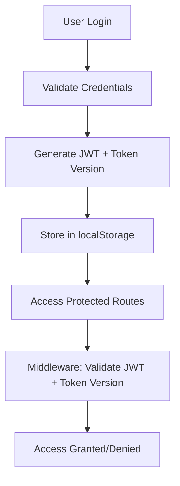

# HELIX ENTERPRISE PLATFORM
## SINGLE SOURCE OF TRUTH (SSOT)

**Document Status:** CANONICAL 🔴  
**Version:** 1.0.0  
**Effective Date:** {{EFFECTIVE_DATE}}  
**Owner:** Project Owner / Enterprise Architect  
**Change Authority:** PM + Tech Lead Approval Required  
**Audience:** Product, Engineering, Security, Operations, Partners  

> **⚠️ GOVERNANCE NOTICE:** This document is the authoritative source for all HELIX Platform decisions, architecture, and standards. In case of conflict, this document overrides all others.

---

## 📋 TABLE OF CONTENTS
1. [Platform Identity & Vision](#1-platform-identity--vision)
2. [Executive Summary](#2-executive-summary)
3. [Architecture Overview](#3-architecture-overview)
4. [Authentication Platform](#4-authentication-platform)
5. [CRM Module](#5-crm-module)
6. [Security & Compliance](#6-security--compliance)
7. [Observability & Operations](#7-observability--operations)
8. [Development Standards](#8-development-standards)
9. [Deployment & Scaling](#9-deployment--scaling)
10. [Roadmap & Phases](#10-roadmap--phases)
11. [Governance Rules](#11-governance-rules)
12. [Appendices](#12-appendices)

---

## 1. PLATFORM IDENTITY & VISION

### 1.1 What HELIX Is
HELIX is an **enterprise-grade, multi-tenant business platform** designed to deliver:
- Secure identity and access management as a standalone service
- Core CRM capabilities as a consumable module
- Full auditability and operational visibility
- Platform independence and integration readiness

### 1.2 What HELIX Is Not
- ❌ Not a monolithic application
- ❌ Not tied to a single business domain
- ❌ Not dependent on specific third-party services
- ❌ Not a rapid prototyping framework

### 1.3 Core Principles
1. **Security First:** Authentication correctness over feature velocity
2. **Platform Independence:** Auth and CRM as independently deployable services
3. **Enterprise Readiness:** Built for compliance, audit, and scale from day one
4. **UX Clarity:** Professional interfaces over feature density
5. **Observability:** Everything traceable, everything logged

---

## 2. EXECUTIVE SUMMARY

### 2.1 Current State (MVP Complete)
- ✅ **Authentication:** JWT with token version invalidation
- ✅ **Multi-tenancy:** Application-layer tenant isolation
- ✅ **CRM Core:** Contacts CRUD with full operations
- ✅ **Foundation:** Docker, PostgreSQL, Redis, CI/CD ready
- ✅ **Testing:** Gate 1-3 validated (Auth, Tenant Isolation, Logging)

### 2.2 Key Architectural Decisions
| Decision | Rationale | Status |
|----------|-----------|--------|
| Modular Monolith | Balance development speed with future scalability | ✅ Locked |
| Shared DB + App-layer Security | Simpler implementation first, RLS later | ✅ Phase 1 |
| NestJS + React | TypeScript ecosystem, enterprise adoption | ✅ Locked |
| JWT with Token Versioning | Stateless auth with invalidation capability | ✅ Implemented |

---

## 3. ARCHITECTURE OVERVIEW

### 3.1 High-Level Architecture
```text
┌─────────────────────────────────────────────────────────────┐
│                 HELIX ENTERPRISE PLATFORM                  │
├────────────────┬────────────────────────────────────────────┤
│  AUTH SERVICE  │                CRM MODULE                 │
│  (Standalone)  │      (Consumer of Auth Service)           │
├────────────────┼────────────────────────────────────────────┤
│ • JWT Issuance │ • Contacts Management                     │
│ • User Mgmt    │ • Accounts & Activities                   │
│ • RBAC Engine  │ • Reporting & Analytics                   │
│ • Audit Logs   │ • Tenant Administration                  │
└────────────────┴────────────────────────────────────────────┘

Shared: PostgreSQL, Redis, Observability
```

### 3.2 Component Architecture
- **Backend:** NestJS modular monolith (Clean Architecture principles)  
- **Frontend:** React 19+ with TypeScript, Vite  
- **Database:** PostgreSQL 15 with Row-Level Security (future)  
- **Cache:** Redis 7 for sessions and rate limiting  
- **Container:** Docker + Docker Compose  
- **CI/CD:** GitHub Actions with quality gates  

### 3.3 Technology Stack
| Layer | Technology | Version | Purpose |
|-------|------------|---------|---------|
| Backend Framework | NestJS | 10.x | Enterprise-grade TypeScript framework |
| ORM | Prisma | 5.x | Type-safe database access |
| Database | PostgreSQL | 15 | ACID compliance, RLS support |
| Cache | Redis | 7 | Sessions, rate limiting, queues |
| Frontend Framework | React | 19.x | Component-based UI |
| Build Tool | Vite | 5.x | Modern frontend tooling |
| Styling | Tailwind CSS | 3.x | Utility-first CSS |
| Container | Docker | Latest | Environment consistency |

---

## 4. AUTHENTICATION PLATFORM

### 4.1 Architecture Principles
1. **Independence:** Auth service deployable without CRM
2. **Reusability:** Can power multiple applications
3. **Security:** All security events logged, no secrets in logs
4. **Token Lifecycle:** Explicit invalidation, short-lived tokens

### 4.2 Current Implementation (MVP)
- **Token Type:** JWT (JSON Web Tokens)  
- **Storage:** localStorage (Phase 0), httpOnly cookies (Phase 1)  
- **Expiry:** 15 minutes (access token)  
- **Invalidation:** Token versioning in database  
- **Password Reset:** Secure, audited flow implemented  

### 4.3 Authentication Flows


## 5. CRM MODULE

### 5.1 Current Capabilities (MVP)
- **Contacts:** Full CRUD operations with tenant isolation  
- **Multi-tenancy:** Organization-based data segregation  
- **UI/UX:** Professional interface with feedback states  
- **Validation:** Frontend and backend validation  

### 5.2 Data Model (Core Entities)
```prisma
// Core CRM Entities
Organization → User → Contact → Account → Activity
         ↓         ↓         ↓
    AuditLog  PasswordReset  Metadata
```

### 5.3 Tenant Isolation Strategy
- **Application Layer:** All queries filtered by `organizationId`  
- **Middleware:** Tenant context injected into every request  
- **Guards:** Route protection with tenant validation  
- **Future:** Database RLS (Row-Level Security) in Phase 2  

---

## 6. SECURITY & COMPLIANCE

### 6.1 Security Model
**Layered Defense:**  
- **Application Layer:** Authentication, RBAC, input validation  
- **Service Layer:** Business logic validation, audit logging  
- **Data Layer:** Database permissions, encryption at rest  

### 6.2 Current Security Implementation
| Control            | Status        | Notes                         |
|--------------------|---------------|-------------------------------|
| JWT Authentication | ✅ Implemented | Token versioning active       |
| Tenant Isolation   | ✅ Implemented | Application-layer enforced    |
| Rate Limiting      | ⚠️ Partial     | Auth endpoints only           |
| Input Validation   | ✅ Basic       | Class-validator in use        |
| Security Headers   | ❌ Missing     | Phase 1 priority              |
| XSS Protection     | ⚠️ Partial     | Basic React escaping          |

### 6.3 Compliance Status
| Standard        | Status         | Target Phase          |
|-----------------|----------------|-----------------------|
| GDPR Basics     | ✅ MVP          | User data handling    |
| Audit Trail     | ✅ MVP          | Basic logging implemented |
| Data Encryption | ✅ MVP          | TLS + at-rest encryption |
| SOC 2           | ❌ Not started  | Phase 3               |
| HIPAA           | ❌ Not started  | Future consideration  |

---

## 7. OBSERVABILITY & OPERATIONS

### 7.1 Logging Strategy
**Current (MVP):**  
- Winston logger with file output  
- Basic request logging  
- Error tracking  

**Target (Enterprise):**  
- Structured JSON logs  
- Request correlation IDs  
- Centralized log aggregation  
- Log retention policies  

### 7.2 Monitoring
**Health Endpoints:**  
- `GET /health` – Basic service health  
- `GET /ready` – Readiness probe (future)  
- `GET /metrics` – Prometheus metrics (future)  

### 7.3 Alerting Strategy
| Metric            | Threshold  | Action                         |
|-------------------|------------|--------------------------------|
| Error Rate         | > 5%        | Immediate investigation        |
| Response Time      | > 1s p95    | Performance review             |
| Auth Failures      | > 10/min    | Security review                |
| Tenant Violations  | Any         | Critical security incident     |

---

## 8. DEVELOPMENT STANDARDS

### 8.1 Code Quality Gates
```yaml
# CI/CD Quality Gates
- TypeScript strict compilation
- ESLint compliance
- Test coverage >80%
- Security vulnerability scan
- Bundle size budget
```

### 8.2 Testing Strategy
| Test Type    | Coverage                 | Tools             |
|--------------|---------------------------|-------------------|
| Unit Tests   | Components, Services      | Jest, Vitest      |
| Integration  | API Endpoints             | Supertest         |
| E2E          | Critical User Flows       | Playwright        |
| Security     | Auth, Tenant Isolation    | Manual gates      |

### 8.3 Code Review Checklist
- Tenant isolation maintained  
- Error handling follows standards  
- Tests added/updated  
- No sensitive data in logs  
- Performance impact considered  
- Security implications reviewed

---

## 9. DEPLOYMENT & SCALING

### 9.1 Current Deployment (MVP)
- **Environment:** Single instance, local development  
- **Database:** Single PostgreSQL instance  
- **Scaling:** Vertical scaling only  
- **Backup:** Manual process  

### 9.2 Target Deployment (Enterprise)
- **Environment:** Multi-region, high availability  
- **Database:** Read replicas + failover  
- **Scaling:** Horizontal auto-scaling  
- **Backup:** Automated, point-in-time recovery  

### 9.3 Scaling Triggers
| Metric          | Threshold        | Action                     |
|-----------------|------------------|----------------------------|
| Database CPU    | > 70% sustained  | Add read replicas          |
| API Response    | > 500ms p95      | Add API instances          |
| Tenant Count    | > 100 active     | Consider microservices     |
| Event Volume    | > 10k/day        | Message queue introduction |

---

## 10. ROADMAP & PHASES

### 10.1 Phase Definitions
| Phase   | Focus                    | Duration   | Status        |
|---------|--------------------------|------------|---------------|
| Phase 0 | Governance & Foundation  | 1–2 weeks  | ✅ COMPLETE   |
| Phase 1 | Enterprise Hardening     | 2–3 weeks  | 🟡 PLANNED    |
| Phase 2 | Platformization          | 3–4 weeks  | 📅 FUTURE     |
| Phase 3 | Enterprise Features      | 4–6 weeks  | 📅 FUTURE     |

### 10.2 Phase 1 Details (Next)
**Focus:** Security hardening, UX elevation, standardization  
**Key Deliverables:**  
- JWT storage security (httpOnly cookies)  
- Security headers (Helmet.js)  
- Design system implementation  
- Centralized logging  
- TypeScript strict mode  
- Testing foundation  

### 10.3 Future Phases Overview
- **Phase 2:** Advanced RBAC, Database RLS, API gateway  
- **Phase 3:** SSO/MFA, Workflow engine, Advanced reporting  
- **Phase 4:** Microservices, Event-driven architecture, Plugin system  

---

## 11. GOVERNANCE RULES

### 11.1 Authority Hierarchy
1. This Document (SSOT) – Ultimate authority  
2. Architecture Documentation – Technical implementation  
3. Security Policies – Security standards  
4. Development Standards – Code quality rules  

### 11.2 Change Control Process
- **Proposal:** Document change with rationale  
- **Review:** PM + Tech Lead approval  
- **Implementation:** Update relevant documentation  
- **Communication:** Notify all stakeholders  
- **Verification:** Ensure adoption  

### 11.3 Documentation Standards
- ✅ Markdown format only (no `.docx` as source)  
- ✅ Version headers on all documents  
- ✅ Clear ownership assignment  
- ✅ Regular review cycles (quarterly)  
- ✅ Archive historical documents  

### 11.4 Non-Negotiable Rules
- **Feature Freeze:** No new features during hardening phases  
- **Security First:** Security fixes override all other work  
- **SSOT Compliance:** All work must align with this document  
- **Tenant Isolation:** Cross-tenant access is critical violation  
- **Audit Trail:** All meaningful actions must be logged  

---

## 12. APPENDICES

### 12.1 Version History
| Version | Date             | Changes               | Approved By         |
|---------|-----------------|----------------------|-------------------|
| 1.0.0   | {{EFFECTIVE_DATE}} | Initial SSOT creation | PM + Tech Lead      |

### 12.2 Reference Documents
- Architecture Overview  
- Security Policy  
- Development Setup  
- Project Roadmap  
- Archive Documentation  

### 12.3 Glossary
| Term | Definition |
|------|------------|
| SSOT | Single Source of Truth – This document |
| RLS  | Row-Level Security – Database security feature |
| JWT  | JSON Web Token – Authentication standard |
| RBAC | Role-Based Access Control |
| MVP  | Minimum Viable Product |
| CSP  | Content Security Policy |

### 12.4 Contact Points
| Concern            | Contact             | Response Time |
|--------------------|---------------------|---------------|
| Technical Issues   | Tech Lead           | < 2 hours     |
| Security Concerns  | Security Team       | < 1 hour      |
| Scope/Requirements | Product Owner       | < 4 hours     |
| Documentation      | Documentation Lead  | < 24 hours    |

---

## 13. SOURCE DOCUMENTS & REFERENCES

### 13.1 Canonical Source Documents
The following documents serve as authoritative sources for project decisions and specifications:

| Document | Purpose | Location |
|----------|---------|----------|
| **HelixCRM.docx** | Enhanced pre-development documentation with technical specifications, error handling, performance baselines, and phase deliverables | `docs/project-docs/HelixCRM.docx` |
| **SSoR.docx** | Single Source of Requirements - Platform constitution and non-negotiable rules | `docs/project-docs/SSoR.docx` |
| **Phases.docx** | Enterprise hardening execution plan with phase definitions and governance | `docs/project-docs/Phases.docx` |
| **Comprehensive Report** | Enterprise compliance, gap analysis, and evolution roadmap | `docs/project-docs/report-tree_2026-01-08.docx` |

### 13.2 Document Authority Hierarchy
1. **This SSOT Document** - Current authoritative reference
2. **Source Word Documents** - Original specifications and decisions
3. **Archived Documentation** - Historical reference in `docs/archive/`

### 13.3 Usage Guidelines
- **For implementation details:** Refer to HelixCRM.docx for technical specifications
- **For platform rules:** Refer to SSoR.docx for non-negotiable principles
- **For phase planning:** Refer to Phases.docx for execution sequence
- **For gap analysis:** Refer to Comprehensive Report for current state assessment

*Note: This SSOT synthesizes and references content from all source documents.*
---

## 🎯 DOCUMENT STATUS
- **Current Status:** CANONICAL 🔴  
- **Next Review:** {{NEXT_REVIEW_DATE}}  
- **Reviewers:** PM, Tech Lead, Security Lead  

---

## ⚠️ GOVERNANCE REMINDER
This document must be referenced in:  
- All project discussions  
- Planning sessions  
- Technical decisions  

Any deviation **requires formal change approval**.

---

**HELIX Platform – Enterprise Ready Foundation**